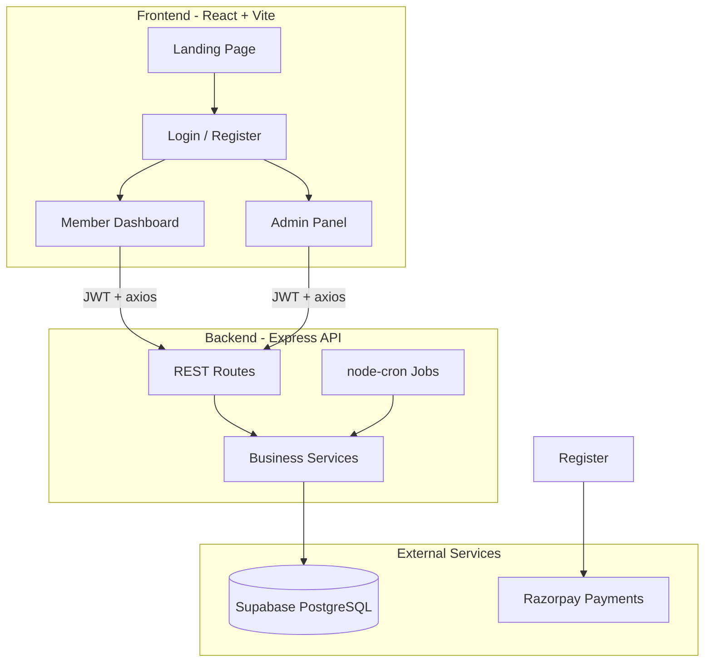
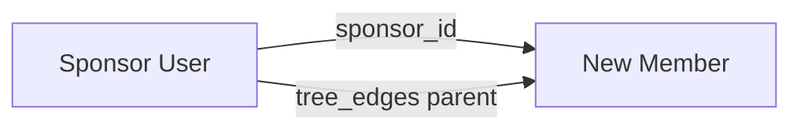
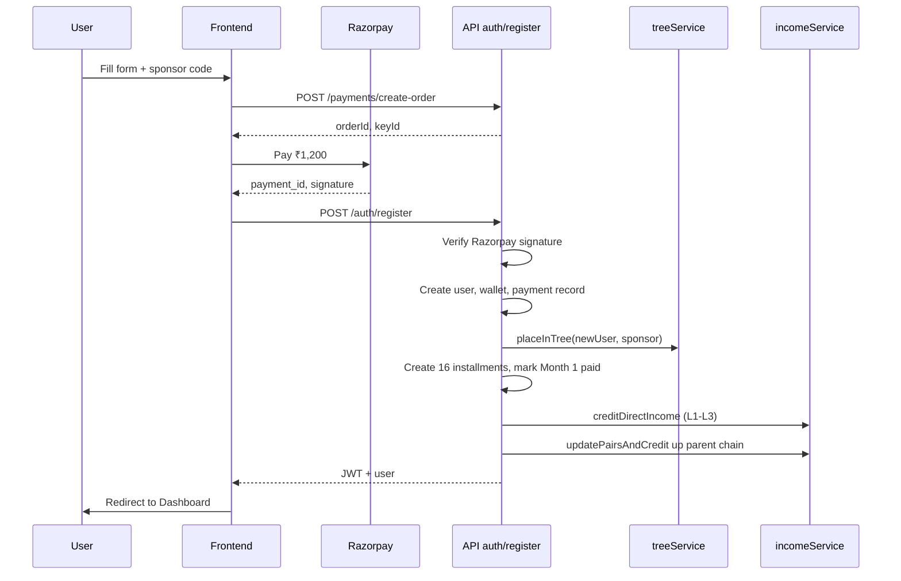

# Samriddhi Network — Complete Project Guide

> **"Plan your work and work your plan"** — Sales Promotion with Exciting Rewards  
> Full-stack MLM web application for Samriddhi Network, Jammu.

This document explains **how the entire project works**: architecture, database, business logic, user flows, APIs, frontend, and deployment.

---

## Table of Contents

1. [Overview](#1-overview)
2. [Architecture](#2-architecture)
3. [Tech Stack](#3-tech-stack)
4. [Project Structure](#4-project-structure)
5. [Core Concepts](#5-core-concepts)
6. [Member Registration Flow](#6-member-registration-flow)
7. [Network Tree (N-ary)](#7-network-tree-n-ary)
8. [Income System](#8-income-system)
9. [Ranks & Rewards](#9-ranks--rewards)
10. [Installments & Compliance](#10-installments--compliance)
11. [Wallet & Withdrawals](#11-wallet--withdrawals)
12. [Products](#12-products)
13. [Lucky Draw](#13-lucky-draw)
14. [Authentication](#14-authentication)
15. [Frontend Application](#15-frontend-application)
16. [Backend API Reference](#16-backend-api-reference)
17. [Database Schema](#17-database-schema)
18. [Automated Jobs (Cron)](#18-automated-jobs-cron)
19. [Admin Panel](#19-admin-panel)
20. [Environment Variables](#20-environment-variables)
21. [Setup & Run Locally](#21-setup--run-locally)
22. [Deployment](#22-deployment)
23. [Business Rules Summary](#23-business-rules-summary)

---

## 1. Overview

Samriddhi Network is a **multi-level marketing (MLM) platform** where members:

- Register with a **sponsor referral code** and pay **₹1,200** activation (Month 1 installment)
- Build an **unlimited-width referral tree** (each member can have unlimited direct children)
- Earn **direct income**, **pair income**, **installment income**, and **rank rewards**
- Pay **₹1,200/month** for 16 months as part of a group savings cycle
- Select **products** (appliances, electronics, etc.) as rewards
- Participate in **monthly lucky draws** when fully compliant

The system has two roles:

| Role | Access |
|------|--------|
| **Member (`user`)** | Dashboard, tree, wallet, income, installments, rewards, products |
| **Admin (`admin`)** | All member features + user management, withdrawals, lucky draw, global stats |

---

## 2. Architecture



**Request flow:**

1. User opens React app (Vercel / local Vite dev server)
2. Frontend calls `VITE_API_URL` (e.g. `http://localhost:5000/api`)
3. Express validates JWT, runs controller → service → Supabase
4. Response JSON updates UI (dashboard, tree, wallet, etc.)

---

## 3. Tech Stack

| Layer | Technology |
|-------|------------|
| Frontend | React 18, Vite 8, Tailwind CSS 4, React Router 7 |
| UI extras | react-d3-tree (network tree), recharts (charts), react-hot-toast |
| Backend | Node.js, Express, express-validator |
| Database | Supabase (PostgreSQL) |
| Auth | JWT (`jsonwebtoken`) + bcrypt password hashing |
| Payments | Razorpay (registration activation) |
| Scheduling | node-cron (monthly income, installment checks) |

---

## 4. Project Structure

```
MLM/
├── backend/
│   ├── server.js                 # Express entry, routes, cron start
│   └── src/
│       ├── config/supabase.js    # Supabase client
│       ├── controllers/          # HTTP handlers (auth, user, tree, wallet, …)
│       ├── middleware/           # auth.js, adminAuth.js, errorHandler.js
│       ├── routes/               # Route definitions per module
│       ├── services/             # Business logic
│       │   ├── treeService.js    # Tree placement, subtree, ancestors
│       │   ├── incomeService.js  # Direct, pair, installment, rank income
│       │   ├── rewardService.js  # Rank assignment, lucky draw
│       │   ├── walletService.js  # Balance credit/debit
│       │   └── installmentService.js
│       └── utils/
│           ├── schema.sql        # Full DB schema (fresh install)
│           ├── migrate-binary-to-nary.sql
│           ├── seed.js           # Admin, ranks, products, groups
│           ├── cronJobs.js
│           └── jwt.js
│
└── frontend/
    ├── src/
    │   ├── App.jsx               # Routes
    │   ├── context/              # AuthContext, AppContext
    │   ├── services/api.js       # Axios + JWT interceptor
    │   ├── pages/
    │   │   ├── Landing.jsx       # Public homepage
    │   │   ├── auth/             # Login, Register
    │   │   ├── Dashboard.jsx, Tree.jsx, Wallet.jsx, …
    │   │   └── admin/            # Admin pages
    │   └── components/layout/    # Sidebar, Layout
    └── vercel.json               # SPA rewrites for React Router
```

---

## 5. Core Concepts

### Two separate relationships

The system tracks **two different links** for every member:

| Concept | Stored in | Purpose |
|---------|-----------|---------|
| **Sponsor (referral)** | `users.sponsor_id` | Who referred you; used for installment income (₹100), direct referral list |
| **Tree parent (placement)** | `tree_nodes.parent_id` + `tree_edges` | Visual network tree; used for direct income (L1–L3) and pair counting |

In the current model, **placement = direct child of sponsor** (no spillover to other branches).



### Group

- Each member belongs to a **group** (`users.group_id`)
- Group settings: max **2,500** members, **16-month** cycle, **₹1,200**/month
- New members inherit sponsor’s group, or join the first active group

---

## 6. Member Registration Flow

**Pages:** `Landing` → `Register` (2 steps) → auto-login → `Dashboard`



**Step-by-step (backend: `authController.register`):**

1. Validate input (name, email, password, sponsor code, Razorpay payment proof)
2. Verify Razorpay HMAC signature (prevents fake payments)
3. Reject duplicate email or reused payment ID
4. Resolve `sponsorCode` → `sponsor_id`
5. Assign `group_id` from sponsor or first active group
6. Insert user with `is_active: true`, generate unique `referral_code`
7. Record payment in `payments` table
8. Create `wallets` row (balance 0)
9. **Tree:** `placeInTree()` — insert `tree_edges` + `tree_nodes` under sponsor
10. **Installments:** create months 1–16; mark month 1 as `paid`
11. **Income:** credit direct income to 3 tree ancestors
12. **Pairs:** walk up to 10 parents — update pairs + check ranks for each
13. Return JWT token

**Registration amount:** ₹1,200 = activation + Month 1 installment.

---

## 7. Network Tree (N-ary)

Previously binary (left/right only). Now **unlimited children per node**.

### Database

| Table | Purpose |
|-------|---------|
| `tree_nodes` | One row per member: `user_id`, `parent_id` |
| `tree_edges` | Parent → child links (`parent_user_id`, `child_user_id`) |

### Placement rule

**Every new member is placed as a direct child of their sponsor** in the tree.

```
        Sponsor
       /   |   \
      B    C    D    …  (unlimited direct children)
```

**Service:** `backend/src/services/treeService.js`

| Function | What it does |
|----------|----------------|
| `placeInTree(newUserId, sponsorId)` | Insert edge sponsor→child, create child node |
| `getSubtree(rootUserId)` | Build nested JSON for `react-d3-tree` UI |
| `getDirectChildren(userId)` | List direct tree children |
| `countSubtreeSize(rootId)` | Total members in a leg (BFS) |
| `getAncestors(userId, 3)` | Walk `parent_id` up 3 levels (direct income) |
| `walkParentChain(userId, 10)` | Walk up 10 levels (pair/rank updates) |

### Tree visualization

- **Page:** `frontend/src/pages/Tree.jsx`
- **API:** `GET /api/tree/my` or `GET /api/tree/:userId` (admin)
- Library: `react-d3-tree` — vertical layout, zoom/pan
- Node colors: active (white/red border), inactive (red tint)

---

## 8. Income System

All earnings go to the **wallet** and are logged in **`income_logs`**.

**Service:** `backend/src/services/incomeService.js`

### 8.1 Direct Income (tree upline)

When a member **registers** (or activates via first product purchase), tree ancestors earn:

| Level | Relationship | Amount |
|-------|--------------|--------|
| L1 | Direct tree parent | ₹400 |
| L2 | Parent’s parent | ₹200 |
| L3 | 3 levels up | ₹100 |

Calculated via `getAncestors(newUserId, 3)` walking `tree_nodes.parent_id`.

### 8.2 Pair Income

**Rule:** Each **direct tree child** = one **leg**. A leg is **active** if its subtree has ≥ 1 member.

```
total_pairs = floor(active_legs / 2)
new_income  = (new_total_pairs - old_total_pairs) × ₹50
```

**Examples:**

| Active legs | Total pairs | New pairs if was 0 |
|-------------|-------------|-------------------|
| 2 | 1 | 1 → ₹50 |
| 3 | 1 | 1 |
| 4 | 2 | 2 → ₹100 |

Stored in `pairs` table: `total_pairs`, `active_leg_count`, `leg_counts` (JSON per leg).

**Triggered when:** new member registers or account activates — updates run up the parent chain (10 levels).

### 8.3 Installment Income

When a member **pays a monthly installment**:

- **₹100** credited to their **direct sponsor** (`users.sponsor_id`, not tree parent)
- Logged as `income_type: installment`

### 8.4 Rank / Monthly Income

For ranks with `monthly_income` (e.g. 4 Star Gold+):

- Cron on **1st of each month** credits active `user_ranks` holders
- Duration from `income_duration_months` in `ranks` table
- Logged as `income_type: rank`

---

## 9. Ranks & Rewards

**14 ranks** seeded in `backend/src/utils/seed.js` (Executive → Black Diamond Director).

### Rank unlock conditions

1. **Pair count** ≥ `ranks.pairs_required`
2. At least **2 direct sponsored children** in the tree (both must have `sponsor_id` = you)

**Service:** `rewardService.checkAndAssignRanks()`

When eligible:

- Insert `user_ranks` (with monthly income window if applicable)
- Insert `user_rewards` with `status: pending_collection`

### Sample ranks

| Rank | Pairs required | Reward |
|------|----------------|--------|
| Executive | 3 | P.P. Set |
| Silver | 36 | Thailand Tour / ₹27,000 |
| 5 Star Ruby | 1,050 | Auto Car |
| Director | 13,500 | XUV Mahindra |
| Black Diamond Director | 2,16,000 | Grand Villa |

**Member page:** `/rewards` — progress bars, claim status.

---

## 10. Installments & Compliance

### Schedule

- **16 months**, **₹1,200** each
- Created on registration (`installmentService.createInstallmentSchedule`)
- Due date: **10th** of each month
- Month 1 marked **paid** at registration

### Payment

- Member pays via `/installments` page → `POST /api/installments/pay`
- Resets `consecutive_missed_installments` to 0
- Credits **₹100** to direct sponsor

### Missed installments (cron)

**Schedule:** 11th of every month (`cronJobs.js`)

1. Find `installments` with `status: pending` and `due_date` passed
2. Mark as `missed`
3. Increment `users.consecutive_missed_installments`
4. If **≥ 4 consecutive misses** → `is_active: false` (ID cancelled)

### Lucky draw eligibility

Members must have **all installments up to draw month** marked `paid` to enter the draw.

---

## 11. Wallet & Withdrawals

### Wallet

- One `wallets` row per user
- Every credit/debit creates a `transactions` row
- **Credits:** direct, pair, installment, rank income
- **Debits:** withdrawal requests (when approved)

### Withdrawal flow

1. Member: `POST /api/wallet/withdraw` (amount + bank details)
2. Status: `pending` in `withdrawals` table
3. Admin: approve or reject via admin panel
4. On approve: debit wallet, update status

**Pages:** `/wallet` (member), `/admin/withdrawals` (admin)

---

## 12. Products

### Tiers

| Tier | Purpose |
|------|---------|
| `booking` | First purchase — activates account (legacy flow) |
| `mid` | Mid-tier reward selection |
| `deluxe` | Deluxe reward |
| `double_id` | Double ID tier |

### Flow

- `GET /api/products` — list active products
- `POST /api/products/purchase` — record selection in `user_products`
- First **booking** purchase can trigger activation + direct/pair income (same as registration path in `productController`)

**Page:** `/products/select`

---

## 13. Lucky Draw

**Admin only:** `POST /api/admin/lucky-draw/:groupId`

**Logic (`rewardService.runLuckyDraw`):**

1. Get active members in group
2. Filter: all installments months 1..N must be `paid`
3. Pick random winner(s) per `reward_catalog` for that month
4. Insert `lucky_draws` + `user_rewards` (type: `lucky_draw`)

**Page:** `/admin/lucky-draw`

---

## 14. Authentication

### JWT

- Issued on login/register (`utils/jwt.js`)
- Stored in `localStorage` as `token`
- Sent as `Authorization: Bearer <token>` on every API call (`frontend/src/services/api.js`)
- Expiry: `JWT_EXPIRES_IN` (default 7 days)

### Middleware

| File | Usage |
|------|-------|
| `middleware/auth.js` | Requires valid JWT; sets `req.user` |
| `middleware/adminAuth.js` | Requires `role === 'admin'` |

### Default admin (after seed)

- Email: `admin@samriddhi.com`
- Password: `Admin@123`

---

## 15. Frontend Application

### Public routes

| Path | Page | Description |
|------|------|-------------|
| `/` | Landing | Marketing homepage, Login / Join Now |
| `/login` | Login | Email + password |
| `/register` | Register | 2-step form + Razorpay ₹1,200 |

### Member routes (requires login)

| Path | Page | Description |
|------|------|-------------|
| `/dashboard` | Dashboard | Wallet, pairs, team, installments alert |
| `/tree` | Tree | Interactive network tree |
| `/income` | Income | Income logs by type |
| `/wallet` | Wallet | Balance, transactions, withdraw |
| `/installments` | Installments | 16-month schedule, pay |
| `/rewards` | Rewards | Rank progress, claim rewards |
| `/products/select` | ProductSelect | Choose products by tier |

### Admin routes (requires admin role)

| Path | Page |
|------|------|
| `/admin/dashboard` | Stats overview |
| `/admin/users` | Member list, block/unblock, view tree |
| `/admin/users/:userId/tree` | Any member’s tree |
| `/admin/products` | Manage products |
| `/admin/groups` | Manage groups |
| `/admin/lucky-draw` | Run draws |
| `/admin/withdrawals` | Approve/reject withdrawals |
| `/admin/rewards` | Pending reward pickups |
| `/admin/income` | Global income monitor |

### State management

- **AuthContext** — `user`, `token`, `login()`, `register()`, `logout()`
- **api.js** — axios instance; 401 → redirect to `/login`

---

## 16. Backend API Reference

Base URL: `http://localhost:5000/api` (or your deployed backend)

### Auth

| Method | Endpoint | Auth | Description |
|--------|----------|------|-------------|
| POST | `/auth/register` | No | Register + Razorpay payment |
| POST | `/auth/login` | No | Login, returns JWT |
| GET | `/auth/me` | Yes | Current user profile |

### Payments

| Method | Endpoint | Auth | Description |
|--------|----------|------|-------------|
| POST | `/payments/create-order` | No | Create Razorpay order (₹1,200) |

### User

| Method | Endpoint | Auth | Description |
|--------|----------|------|-------------|
| GET | `/user/dashboard` | Yes | Team, wallet, pairs, rank, transactions |
| GET | `/user/profile` | Yes | Profile + sponsor info |

### Tree

| Method | Endpoint | Auth | Description |
|--------|----------|------|-------------|
| GET | `/tree/my` | Yes | My network subtree |
| GET | `/tree/referrals` | Yes | Direct referrals (sponsor_id) |
| GET | `/tree/:userId` | Yes | Any user’s subtree |

### Wallet

| Method | Endpoint | Auth | Description |
|--------|----------|------|-------------|
| GET | `/wallet` | Yes | Balance + recent transactions |
| POST | `/wallet/withdraw` | Yes | Request withdrawal |
| GET | `/wallet/withdrawals` | Yes | My withdrawal history |
| GET | `/wallet/income` | Yes | Income logs |

### Installments

| Method | Endpoint | Auth | Description |
|--------|----------|------|-------------|
| GET | `/installments/my` | Yes | 16-month schedule |
| POST | `/installments/pay` | Yes | Pay a month |

### Products

| Method | Endpoint | Auth | Description |
|--------|----------|------|-------------|
| GET | `/products` | Yes | List products |
| GET | `/products/my` | Yes | My selections |
| POST | `/products/purchase` | Yes | Select product |

### Rewards

| Method | Endpoint | Auth | Description |
|--------|----------|------|-------------|
| GET | `/rewards` | Yes | Rewards + rank progress |
| GET | `/rewards/ranks` | Yes | Achieved ranks |

### Admin (admin JWT required)

| Method | Endpoint | Description |
|--------|----------|-------------|
| GET | `/admin/stats` | Dashboard statistics |
| GET | `/admin/users` | List/search users |
| PATCH | `/admin/users/:id/block` | Block user |
| PATCH | `/admin/users/:id/unblock` | Unblock user |
| GET/POST | `/admin/products` | Manage products |
| GET/POST | `/admin/groups` | Manage groups |
| GET | `/admin/withdrawals` | Pending withdrawals |
| PATCH | `/admin/withdrawals/:id/approve` | Approve |
| PATCH | `/admin/withdrawals/:id/reject` | Reject |
| POST | `/admin/lucky-draw/:groupId` | Run lucky draw |
| GET | `/admin/lucky-draw/history` | Draw history |
| GET | `/admin/rewards/pending` | Pending pickups |
| PATCH | `/admin/rewards/:id/mark-collected` | Mark collected |
| GET | `/admin/income-logs` | All income logs |

### Health

| Method | Endpoint | Description |
|--------|----------|-------------|
| GET | `/health` | API status check |

---

## 17. Database Schema

**File:** `backend/src/utils/schema.sql`

| # | Table | Purpose |
|---|-------|---------|
| 1 | `groups` | MLM groups (2500 cap, 16 months) |
| 2 | `users` | Members + admins, sponsor link, referral code |
| 3 | `tree_nodes` | Tree position (parent_id) |
| 4 | `tree_edges` | Parent → child links (unlimited width) |
| 5 | `wallets` | Member balance |
| 6 | `products` | Product catalog by tier |
| 7 | `user_products` | Member product selections |
| 8 | `transactions` | Wallet credit/debit history |
| 9 | `income_logs` | direct / pair / installment / rank |
| 10 | `pairs` | Pair counts per user |
| 11 | `installments` | 16-month payment schedule |
| 12 | `reward_catalog` | Lucky draw prizes by month |
| 13 | `lucky_draws` | Draw results |
| 14 | `ranks` | Rank definitions |
| 15 | `user_ranks` | Achieved ranks + monthly income period |
| 16 | `user_rewards` | Physical rewards to collect |
| 17 | `withdrawals` | Withdrawal requests |
| 18 | `payments` | Razorpay registration payments |

### Migration from old binary tree

If upgrading an existing database that used `binary_tree` (left/right columns), run:

`backend/src/utils/migrate-binary-to-nary.sql`

---

## 18. Automated Jobs (Cron)

Started when backend boots (`server.js` → `startCronJobs()`).

| Schedule | Job | Function |
|----------|-----|----------|
| `0 0 1 * *` (1st of month, midnight) | Monthly rank income | `creditMonthlyRankIncome()` |
| `0 0 11 * *` (11th of month, midnight) | Missed installment check | `checkMissedInstallments()` |

---

## 19. Admin Panel

Admins log in with the same `/login` page; JWT includes `role: admin` → redirect to `/admin/dashboard`.

**Capabilities:**

- View platform stats (members, income, withdrawals)
- Block/unblock members
- View any member’s network tree
- Approve wallet withdrawals
- Run monthly lucky draws per group
- Mark physical rewards as collected
- Monitor all income logs globally
- Manage products and groups

---

## 20. Environment Variables

### Backend (`backend/.env`)

```env
PORT=5000
SUPABASE_URL=https://your-project.supabase.co
SUPABASE_SERVICE_ROLE_KEY=your_service_role_key
JWT_SECRET=your_random_secret_min_32_chars
JWT_EXPIRES_IN=7d
FRONTEND_URL=http://localhost:5173
RAZORPAY_KEY_ID=rzp_test_xxxxx
RAZORPAY_KEY_SECRET=xxxxx
NODE_ENV=development
```

### Frontend (`frontend/.env`)

```env
VITE_API_URL=http://localhost:5000/api
```

Production example:

```env
VITE_API_URL=https://your-backend.onrender.com/api
```

---

## 21. Setup & Run Locally

### 1. Database

1. Create Supabase project
2. Run `backend/src/utils/schema.sql` in SQL Editor
3. (Optional) Run `migrate-binary-to-nary.sql` if upgrading

### 2. Backend

```bash
cd backend
cp .env.example .env
# Edit .env with Supabase + Razorpay + JWT keys
npm install
npm run seed
npm run dev
```

API: `http://localhost:5000`

### 3. Frontend

```bash
cd frontend
cp .env.example .env
# Set VITE_API_URL=http://localhost:5000/api
npm install
npm run dev
```

App: `http://localhost:5173`

---

## 22. Deployment

### Frontend (Vercel)

- **Root directory:** `frontend`
- **Build command:** `npm run build`
- **Output directory:** `dist`
- **Env:** `VITE_API_URL` = production API URL
- `vercel.json` rewrites all routes to `index.html` (SPA)

### Backend (Render / Railway)

- **Root directory:** `backend`
- **Start command:** `npm start`
- Set all backend env vars
- Keep server running 24/7 for cron jobs

### Single-service option

If `NODE_ENV=production`, `server.js` can also serve `frontend/dist` as static files (monolith deploy).

---

## 23. Business Rules Summary

| Rule | Value |
|------|-------|
| Monthly installment | ₹1,200 |
| Due date | 1st–10th of each month |
| Group size | Up to 2,500 members |
| Cycle length | 16 months |
| Missed installments before cancel | 4 consecutive |
| Registration / activation | ₹1,200 (Month 1 included) |
| Direct income | ₹400 / ₹200 / ₹100 (L1–L3) |
| Pair income | ₹50 per new pair |
| Installment income to sponsor | ₹100 per payment |
| Tree width | Unlimited direct children per node |
| Pair formula | `floor(active_legs / 2)` |
| Rank prerequisite | ≥ 2 direct sponsored children + pair threshold |
| Rewards | Products only; ID proof required for collection |

---

## Contact

**Samriddhi Network**

- Phone: [9419185768](tel:9419185768)
- Email: samriddhinetwork349@gmail.com
- Address: Opp. General Bus Stand, B.C. Road, Ground Floor, Jammu

---

*Last updated to reflect N-ary tree, landing page, and current codebase structure.*
